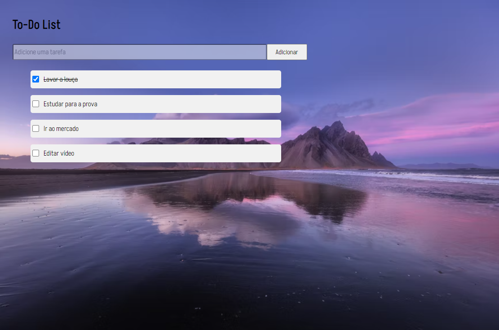

## To Do List

Desafio proposto no curso de Introdução a JavaScript durante o Bootcamp Spread Fullstack Developer proporcionado pela Digital Innovation One em parceria com Spread. O objetivo do desafio é criar uma lista de tarefas com as seguintes funcionalidades:
 1. Crie um campo de input de texto e um botão para adicionar a tarefa à lista;
 2. Quando o botão for pressionado, o texto deve aparecer na lista com um checkbox ao lado;
 3. Quando o usuário selecionar o checkbox, o item correspondente deve ficar com o texto riscado. 

## Ideias para próximas versões:
 - Fazer uma lista das tarefas concluídas (quando o usuário marcar a task como feita, ela será alocada para uma lista de tarefas já realizadas);
 - Deletar as tarefas adicionadas (quando o usuário não ver mais a necessidade de realizar determinada tarefa já adicionada, ele poderá excluí-la);